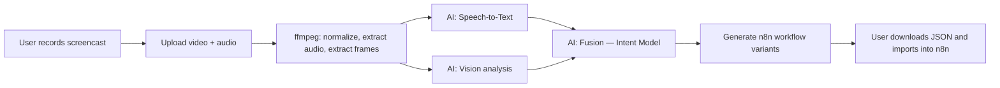
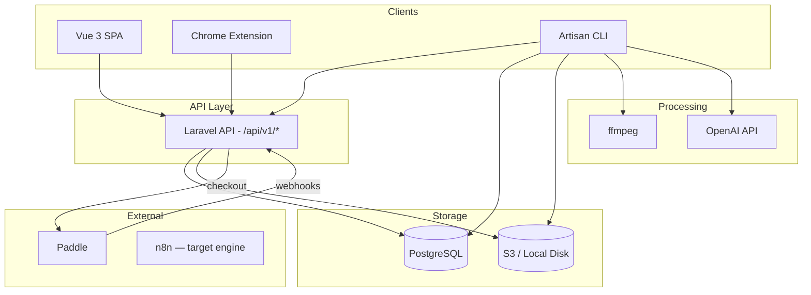
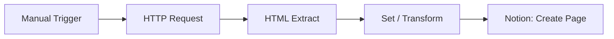
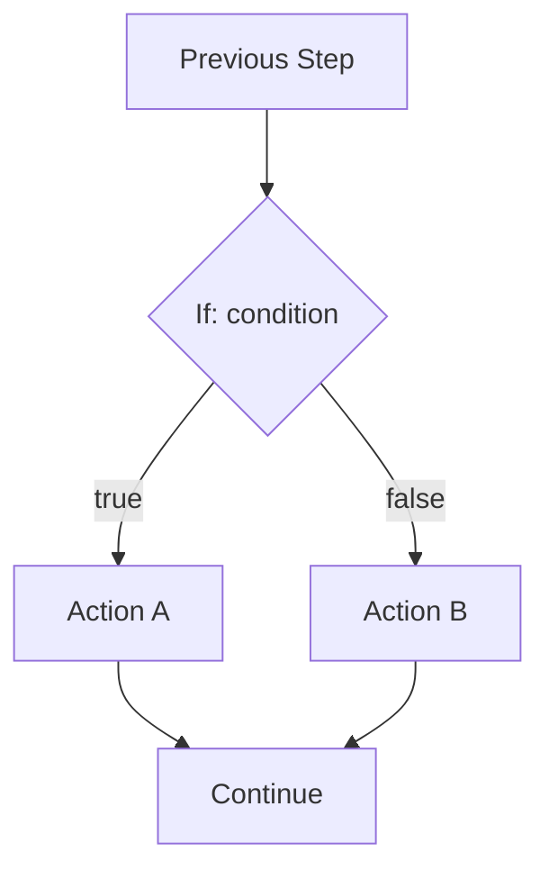
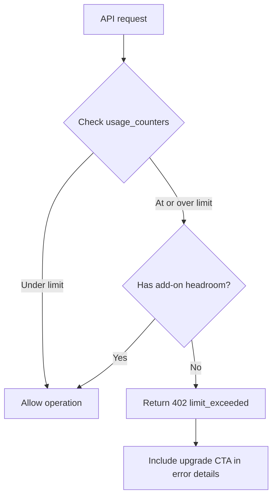

# FlowCast — Architecture & Design Document

> **Version:** 1.0.0  
> **Date:** 2026-03-22  
> **Status:** Draft  
> **Scope:** Single source of truth for all implementation phases

---

## Table of Contents

1. [Product Overview & Personas](#1-product-overview--personas)
2. [Tech Stack & Architecture Principles](#2-tech-stack--architecture-principles)
3. [Database Schema Design](#3-database-schema-design)
4. [API Endpoint Catalog](#4-api-endpoint-catalog)
5. [Artisan Commands Design](#5-artisan-commands-design)
6. [Media & AI Pipeline](#6-media--ai-pipeline)
7. [Workflow Generation for n8n](#7-workflow-generation-for-n8n)
8. [Commercial Model & Paddle Integration](#8-commercial-model--paddle-integration)
9. [Frontend App Structure](#9-frontend-app-structure)
10. [SEO Landing Page](#10-seo-landing-page)
11. [Chrome Extension — Manifest v3](#11-chrome-extension--manifest-v3)
12. [Admin & Analytics](#12-admin--analytics)
13. [Security, Privacy, GDPR](#13-security-privacy-gdpr)
14. [QA Strategy & Roadmap](#14-qa-strategy--roadmap)

---

## 1. Product Overview & Personas

### 1.1 Core Concept

FlowCast is a SaaS product that converts **screencasts with audio narration** into **executable n8n workflows**. Users record or upload a video demonstrating a browser-based process, FlowCast processes the media through an AI pipeline to understand the sequence of actions and user intent, then generates importable n8n workflow JSON files.

The pipeline flow:



### 1.2 Personas

#### Alex — Solo Maker

| Attribute | Detail |
|---|---|
| **Role** | Freelance developer / no-code builder |
| **Primary goals** | Quickly turn ad-hoc processes into reusable n8n workflows; reduce time from idea to automation from hours to minutes |
| **Success looks like** | Records a 3-minute screencast of scraping a site and pushing to Notion, gets a working n8n JSON in under 5 minutes |
| **Typical monthly usage** | 8–15 recordings, 2–5 min each, generating 1–2 workflow variants per recording |
| **Likely plan** | **Starter** — sufficient conversions and storage for personal use |

#### Sam — Agency Ops

| Attribute | Detail |
|---|---|
| **Role** | Operations lead at a small automation agency serving multiple clients |
| **Primary goals** | Receive screen recordings from clients, convert them into automations, maintain client separation via organizations |
| **Success looks like** | Client sends a Loom-style video, Sam uploads it, gets intent + workflow, refines in n8n, delivers to client same day |
| **Typical monthly usage** | 30–60 recordings across 5–10 client projects, 3–10 min each, multiple workflow variants |
| **Likely plan** | **Pro** — needs higher conversion limits, more storage, and multiple seats |

#### Jordan — Internal Ops Engineer

| Attribute | Detail |
|---|---|
| **Role** | Process engineer at a mid-size company standardizing internal workflows |
| **Primary goals** | Convert Zoom/video process demos into formal automation specs; maintain audit trails; control costs predictably |
| **Success looks like** | Department heads record how-to videos, Jordan runs them through FlowCast, generates standardized n8n workflows with logging, presents to management with clear provenance |
| **Typical monthly usage** | 15–30 recordings, 5–15 min each, always uses `with_logging` variant, needs admin visibility |
| **Likely plan** | **Enterprise** — needs compliance features, admin dashboard, higher limits, priority support |

---

## 2. Tech Stack & Architecture Principles

### 2.1 Full Tech Stack

| Layer | Technology | Version / Notes |
|---|---|---|
| **Backend framework** | Laravel | 12, PHP 8.3+ |
| **Frontend framework** | Vue 3 | Composition API |
| **UI components** | shadcn-vue | With Tailwind CSS |
| **Build tool** | Vite | Laravel Vite plugin |
| **Database** | PostgreSQL | 16+ |
| **Object storage** | S3-compatible | Local disk driver in dev |
| **Media processing** | ffmpeg | System binary |
| **AI — STT** | OpenAI Whisper API | Or compatible endpoint |
| **AI — Vision** | OpenAI GPT-4o Vision | Or compatible endpoint |
| **AI — Fusion** | OpenAI GPT-4o | Text model for intent synthesis |
| **Workflow engine** | n8n | Latest; first-class target, architecture allows future engines |
| **Payments** | Paddle | Billing platform with webhooks |
| **Auth** | Laravel Sanctum | Token-based API auth |
| **MCP servers** | `postgres_local`, `context7` | DB management, n8n context |

### 2.2 Architecture Principles

#### API-First

All business capabilities are exposed under `/api/v1/...`. The Vue SPA and Chrome extension are thin clients consuming these APIs. No server-rendered views for application logic — only the SEO landing page is server-rendered.

#### CLI-Second

Every major background workflow exists as an Artisan command. Commands are designed to be run by cron or manually. This replaces the need for Laravel queues/workers.

#### No Jobs/Queues

**Design decision:** Laravel jobs, queues, Horizon, and workers are explicitly not used. All asynchronous work is handled by Artisan commands invoked via cron schedules or manual terminal execution. This simplifies deployment and debugging.

#### Multi-Tenancy

- Tenant boundary: **Organization**
- All tenant-owned tables include an `organization_id` column
- All queries are scoped by `organization_id` — enforced via Laravel global scopes on Eloquent models
- A user belongs to one or more organizations via the `organization_user` pivot table
- The "current organization" is resolved from the authenticated user's context (default org or header-specified)

#### MCP Usage Patterns

| MCP Server | Usage |
|---|---|
| `postgres_local` | DB schema introspection, migration verification, test data queries |
| `context7` | n8n node catalog lookups, workflow pattern validation, schema references |

### 2.3 High-Level Architecture Diagram



---

## 3. Database Schema Design

All tables use `bigIncrements` for primary keys and `timestamps()` for `created_at` / `updated_at`. UUIDs are used as public-facing identifiers where noted. All tenant-scoped tables include `organization_id` with a foreign key constraint.

### 3.1 `organizations`

**Purpose:** Root tenant entity. All resources belong to an organization.

| Column | Type | Nullable | Default | Notes |
|---|---|---|---|---|
| `id` | `bigint` (PK) | No | auto | Internal ID |
| `uuid` | `uuid` | No | `gen_random_uuid()` | Public identifier |
| `name` | `varchar(255)` | No | — | Organization display name |
| `slug` | `varchar(255)` | No | — | URL-safe identifier |
| `owner_user_id` | `bigint` (FK → users.id) | No | — | Creator / primary owner |
| `created_at` | `timestamp` | No | `now()` | — |
| `updated_at` | `timestamp` | No | `now()` | — |

**Indexes:**
- `UNIQUE(uuid)`
- `UNIQUE(slug)`
- `INDEX(owner_user_id)`

**Example row:**

```json
{
  "id": 1,
  "uuid": "a1b2c3d4-e5f6-7890-abcd-ef1234567890",
  "name": "Acme Automations",
  "slug": "acme-automations",
  "owner_user_id": 1,
  "created_at": "2026-01-15T10:00:00Z",
  "updated_at": "2026-01-15T10:00:00Z"
}
```

---

### 3.2 `users`

**Purpose:** Authentication and identity. Users can belong to multiple organizations.

| Column | Type | Nullable | Default | Notes |
|---|---|---|---|---|
| `id` | `bigint` (PK) | No | auto | — |
| `uuid` | `uuid` | No | `gen_random_uuid()` | Public identifier |
| `name` | `varchar(255)` | No | — | Display name |
| `email` | `varchar(255)` | No | — | Login email |
| `email_verified_at` | `timestamp` | Yes | `null` | Email verification timestamp |
| `password` | `varchar(255)` | No | — | Bcrypt hash |
| `is_superadmin` | `boolean` | No | `false` | Platform-level admin flag |
| `remember_token` | `varchar(100)` | Yes | `null` | Laravel remember token |
| `created_at` | `timestamp` | No | `now()` | — |
| `updated_at` | `timestamp` | No | `now()` | — |

**Indexes:**
- `UNIQUE(uuid)`
- `UNIQUE(email)`

**Example row:**

```json
{
  "id": 1,
  "uuid": "u-aaaa-bbbb-cccc-dddd",
  "name": "Alex Maker",
  "email": "alex@example.com",
  "email_verified_at": "2026-01-15T10:05:00Z",
  "password": "$2y$12$...",
  "is_superadmin": false,
  "remember_token": null,
  "created_at": "2026-01-15T10:00:00Z",
  "updated_at": "2026-01-15T10:00:00Z"
}
```

---

### 3.3 `organization_user`

**Purpose:** Pivot table for many-to-many relationship between users and organizations with role assignment.

| Column | Type | Nullable | Default | Notes |
|---|---|---|---|---|
| `id` | `bigint` (PK) | No | auto | — |
| `organization_id` | `bigint` (FK → organizations.id) | No | — | CASCADE on delete |
| `user_id` | `bigint` (FK → users.id) | No | — | CASCADE on delete |
| `role` | `varchar(50)` | No | `'member'` | One of: `owner`, `admin`, `member` |
| `created_at` | `timestamp` | No | `now()` | — |
| `updated_at` | `timestamp` | No | `now()` | — |

**Indexes:**
- `UNIQUE(organization_id, user_id)`
- `INDEX(user_id)`

**Example row:**

```json
{
  "id": 1,
  "organization_id": 1,
  "user_id": 1,
  "role": "owner",
  "created_at": "2026-01-15T10:00:00Z",
  "updated_at": "2026-01-15T10:00:00Z"
}
```

---

### 3.4 `api_keys`

**Purpose:** Bearer tokens for API and Chrome extension authentication, scoped to an organization.

| Column | Type | Nullable | Default | Notes |
|---|---|---|---|---|
| `id` | `bigint` (PK) | No | auto | — |
| `uuid` | `uuid` | No | `gen_random_uuid()` | Public identifier |
| `organization_id` | `bigint` (FK → organizations.id) | No | — | CASCADE on delete |
| `user_id` | `bigint` (FK → users.id) | No | — | Creator; SET NULL on delete |
| `label` | `varchar(255)` | No | — | User-provided label |
| `key_hash` | `varchar(255)` | No | — | SHA-256 hash of the key |
| `key_prefix` | `varchar(8)` | No | — | First 8 chars for identification |
| `last_used_at` | `timestamp` | Yes | `null` | Last successful auth |
| `revoked_at` | `timestamp` | Yes | `null` | Soft-revocation timestamp |
| `created_at` | `timestamp` | No | `now()` | — |
| `updated_at` | `timestamp` | No | `now()` | — |

**Indexes:**
- `UNIQUE(uuid)`
- `UNIQUE(key_hash)`
- `INDEX(organization_id)`
- `INDEX(key_prefix)`

**Key generation:** A 48-character random string prefixed with `fc_` (e.g., `fc_a1b2c3d4...`). The full key is shown once at creation time. Only the SHA-256 hash and 8-char prefix are stored.

**Example row:**

```json
{
  "id": 1,
  "uuid": "ak-1111-2222-3333-4444",
  "organization_id": 1,
  "user_id": 1,
  "label": "Work laptop Chrome",
  "key_hash": "e3b0c44298fc1c149afbf4c8996fb92427ae41e4649b934ca495991b7852b855",
  "key_prefix": "fc_a1b2c",
  "last_used_at": "2026-02-10T14:30:00Z",
  "revoked_at": null,
  "created_at": "2026-01-15T10:10:00Z",
  "updated_at": "2026-02-10T14:30:00Z"
}
```

---

### 3.5 `plans`

**Purpose:** Defines available subscription plans with their limits. Seeded via `plans:sync` command.

| Column | Type | Nullable | Default | Notes |
|---|---|---|---|---|
| `id` | `bigint` (PK) | No | auto | — |
| `code` | `varchar(50)` | No | — | Machine name: `starter`, `pro`, `enterprise` |
| `name` | `varchar(100)` | No | — | Display name |
| `price_monthly_cents` | `integer` | No | — | Monthly price in cents |
| `price_yearly_cents` | `integer` | No | — | Yearly price in cents |
| `max_conversions_per_month` | `integer` | No | — | Workflow generation limit |
| `max_recording_duration_seconds` | `integer` | No | — | Per-recording max length |
| `max_storage_mb` | `integer` | No | — | Total storage allowance |
| `max_seats` | `integer` | No | — | Max org members |
| `paddle_product_id` | `varchar(100)` | Yes | `null` | Paddle product reference |
| `paddle_monthly_price_id` | `varchar(100)` | Yes | `null` | Paddle monthly price ID |
| `paddle_yearly_price_id` | `varchar(100)` | Yes | `null` | Paddle yearly price ID |
| `is_active` | `boolean` | No | `true` | Whether plan is available for new signups |
| `sort_order` | `integer` | No | `0` | Display ordering |
| `created_at` | `timestamp` | No | `now()` | — |
| `updated_at` | `timestamp` | No | `now()` | — |

**Indexes:**
- `UNIQUE(code)`

**Example row:**

```json
{
  "id": 2,
  "code": "pro",
  "name": "Pro",
  "price_monthly_cents": 4900,
  "price_yearly_cents": 47000,
  "max_conversions_per_month": 100,
  "max_recording_duration_seconds": 1800,
  "max_storage_mb": 10240,
  "max_seats": 10,
  "paddle_product_id": "pro_abc123",
  "paddle_monthly_price_id": "pri_monthly_pro",
  "paddle_yearly_price_id": "pri_yearly_pro",
  "is_active": true,
  "sort_order": 2,
  "created_at": "2026-01-01T00:00:00Z",
  "updated_at": "2026-01-01T00:00:00Z"
}
```

---

### 3.6 `subscriptions`

**Purpose:** Tracks the active subscription for each organization, mapped to Paddle subscription lifecycle.

| Column | Type | Nullable | Default | Notes |
|---|---|---|---|---|
| `id` | `bigint` (PK) | No | auto | — |
| `uuid` | `uuid` | No | `gen_random_uuid()` | Public identifier |
| `organization_id` | `bigint` (FK → organizations.id) | No | — | CASCADE on delete |
| `plan_id` | `bigint` (FK → plans.id) | No | — | RESTRICT on delete |
| `paddle_subscription_id` | `varchar(100)` | Yes | `null` | Paddle's subscription ID |
| `paddle_customer_id` | `varchar(100)` | Yes | `null` | Paddle's customer ID |
| `status` | `varchar(30)` | No | `'trialing'` | `trialing`, `active`, `past_due`, `paused`, `canceled`, `expired` |
| `billing_cycle` | `varchar(10)` | No | `'monthly'` | `monthly` or `yearly` |
| `current_period_start` | `timestamp` | Yes | `null` | Billing period start |
| `current_period_end` | `timestamp` | Yes | `null` | Billing period end |
| `trial_ends_at` | `timestamp` | Yes | `null` | Trial expiration |
| `canceled_at` | `timestamp` | Yes | `null` | When cancellation was requested |
| `created_at` | `timestamp` | No | `now()` | — |
| `updated_at` | `timestamp` | No | `now()` | — |

**Indexes:**
- `UNIQUE(uuid)`
- `UNIQUE(organization_id)` — one active subscription per org
- `INDEX(paddle_subscription_id)`
- `INDEX(status)`

**Example row:**

```json
{
  "id": 1,
  "uuid": "sub-aaaa-bbbb-cccc",
  "organization_id": 1,
  "plan_id": 2,
  "paddle_subscription_id": "sub_01h1234567",
  "paddle_customer_id": "ctm_01h7654321",
  "status": "active",
  "billing_cycle": "monthly",
  "current_period_start": "2026-02-01T00:00:00Z",
  "current_period_end": "2026-03-01T00:00:00Z",
  "trial_ends_at": null,
  "canceled_at": null,
  "created_at": "2026-01-15T10:00:00Z",
  "updated_at": "2026-02-01T00:00:00Z"
}
```

---

### 3.7 `usage_counters`

**Purpose:** Tracks monthly usage per organization for enforcing plan limits. One row per org per month per metric.

| Column | Type | Nullable | Default | Notes |
|---|---|---|---|---|
| `id` | `bigint` (PK) | No | auto | — |
| `organization_id` | `bigint` (FK → organizations.id) | No | — | CASCADE on delete |
| `metric` | `varchar(50)` | No | — | `conversions`, `storage_mb`, `recordings` |
| `period` | `varchar(7)` | No | — | Format: `YYYY-MM` (e.g., `2026-03`) |
| `value` | `integer` | No | `0` | Current count/amount |
| `created_at` | `timestamp` | No | `now()` | — |
| `updated_at` | `timestamp` | No | `now()` | — |

**Indexes:**
- `UNIQUE(organization_id, metric, period)`

**Example row:**

```json
{
  "id": 1,
  "organization_id": 1,
  "metric": "conversions",
  "period": "2026-03",
  "value": 7,
  "created_at": "2026-03-01T00:00:00Z",
  "updated_at": "2026-03-15T09:00:00Z"
}
```

---

### 3.8 `recordings`

**Purpose:** Core entity representing an uploaded screencast and its processing state through the pipeline.

| Column | Type | Nullable | Default | Notes |
|---|---|---|---|---|
| `id` | `bigint` (PK) | No | auto | — |
| `uuid` | `uuid` | No | `gen_random_uuid()` | Public identifier |
| `organization_id` | `bigint` (FK → organizations.id) | No | — | CASCADE on delete |
| `user_id` | `bigint` (FK → users.id) | No | — | Uploader; SET NULL on delete |
| `title` | `varchar(255)` | Yes | `null` | User-provided or auto-generated title |
| `original_filename` | `varchar(255)` | No | — | Original upload filename |
| `mime_type` | `varchar(100)` | No | — | e.g., `video/webm`, `video/mp4` |
| `file_size_bytes` | `bigint` | No | — | Original file size |
| `duration_seconds` | `integer` | Yes | `null` | Populated after ffprobe |
| `status` | `varchar(30)` | No | `'uploaded'` | `uploaded`, `processing_media`, `media_ready`, `processing_ai`, `intent_ready`, `generating_workflows`, `workflows_ready`, `failed` |
| `source` | `varchar(20)` | No | `'web'` | `web` or `extension` |
| `storage_path` | `varchar(500)` | No | — | S3 path to original upload |
| `created_at` | `timestamp` | No | `now()` | — |
| `updated_at` | `timestamp` | No | `now()` | — |

**Indexes:**
- `UNIQUE(uuid)`
- `INDEX(organization_id, status)`
- `INDEX(organization_id, created_at DESC)`
- `INDEX(status)` — for command batch selection

**Example row:**

```json
{
  "id": 42,
  "uuid": "rec-1234-5678-abcd",
  "organization_id": 1,
  "user_id": 1,
  "title": "Scrape product data to Notion",
  "original_filename": "demo-recording.webm",
  "mime_type": "video/webm",
  "file_size_bytes": 15728640,
  "duration_seconds": 185,
  "status": "intent_ready",
  "source": "extension",
  "storage_path": "recordings/1/rec-1234-5678-abcd/original.webm",
  "created_at": "2026-03-10T14:00:00Z",
  "updated_at": "2026-03-10T14:05:00Z"
}
```

---

### 3.9 `recording_assets`

**Purpose:** Tracks derived files from media processing (normalized video, audio, frames, thumbnails).

| Column | Type | Nullable | Default | Notes |
|---|---|---|---|---|
| `id` | `bigint` (PK) | No | auto | — |
| `recording_id` | `bigint` (FK → recordings.id) | No | — | CASCADE on delete |
| `asset_type` | `varchar(50)` | No | — | `normalized_video`, `audio`, `frame`, `thumbnail`, `transcript_json` |
| `storage_path` | `varchar(500)` | No | — | S3 path |
| `mime_type` | `varchar(100)` | No | — | — |
| `file_size_bytes` | `bigint` | No | `0` | — |
| `metadata` | `jsonb` | Yes | `null` | Extra info (e.g., `{"frame_number": 12, "timestamp_ms": 23000}`) |
| `created_at` | `timestamp` | No | `now()` | — |
| `updated_at` | `timestamp` | No | `now()` | — |

**Indexes:**
- `INDEX(recording_id, asset_type)`

**Example row:**

```json
{
  "id": 100,
  "recording_id": 42,
  "asset_type": "frame",
  "storage_path": "recordings/1/rec-1234-5678-abcd/frames/frame_0012.jpg",
  "mime_type": "image/jpeg",
  "file_size_bytes": 52400,
  "metadata": {"frame_number": 12, "timestamp_ms": 23000},
  "created_at": "2026-03-10T14:02:00Z",
  "updated_at": "2026-03-10T14:02:00Z"
}
```

---

### 3.10 `ai_intents`

**Purpose:** Stores the structured Workflow Intent Model produced by the AI fusion step.

| Column | Type | Nullable | Default | Notes |
|---|---|---|---|---|
| `id` | `bigint` (PK) | No | auto | — |
| `uuid` | `uuid` | No | `gen_random_uuid()` | Public identifier |
| `recording_id` | `bigint` (FK → recordings.id) | No | — | CASCADE on delete |
| `organization_id` | `bigint` (FK → organizations.id) | No | — | CASCADE on delete; denormalized for query efficiency |
| `version` | `integer` | No | `1` | Incremented on regeneration |
| `title` | `varchar(255)` | Yes | `null` | AI-generated title for the workflow |
| `description` | `text` | Yes | `null` | AI-generated summary |
| `intent_json` | `jsonb` | No | — | Full Intent Model JSON |
| `model_used` | `varchar(100)` | No | — | e.g., `gpt-4o-2026-01-01` |
| `prompt_tokens` | `integer` | Yes | `null` | Token usage tracking |
| `completion_tokens` | `integer` | Yes | `null` | Token usage tracking |
| `created_at` | `timestamp` | No | `now()` | — |
| `updated_at` | `timestamp` | No | `now()` | — |

**Indexes:**
- `UNIQUE(uuid)`
- `UNIQUE(recording_id, version)`
- `INDEX(organization_id)`

**Example row:**

```json
{
  "id": 30,
  "uuid": "int-aaaa-bbbb-cccc",
  "recording_id": 42,
  "organization_id": 1,
  "version": 1,
  "title": "Scrape product data and push to Notion",
  "description": "Navigates to a product listing page, extracts product names and prices, then creates entries in a Notion database.",
  "intent_json": {"steps": [{"action": "http_request", "params": {"url": "https://example.com/products"}}]},
  "model_used": "gpt-4o-2026-01-01",
  "prompt_tokens": 4200,
  "completion_tokens": 1800,
  "created_at": "2026-03-10T14:04:00Z",
  "updated_at": "2026-03-10T14:04:00Z"
}
```

---

### 3.11 `workflows`

**Purpose:** Stores generated n8n workflow JSON for each recording, one row per variant.

| Column | Type | Nullable | Default | Notes |
|---|---|---|---|---|
| `id` | `bigint` (PK) | No | auto | — |
| `uuid` | `uuid` | No | `gen_random_uuid()` | Public identifier |
| `recording_id` | `bigint` (FK → recordings.id) | No | — | CASCADE on delete |
| `ai_intent_id` | `bigint` (FK → ai_intents.id) | No | — | CASCADE on delete |
| `organization_id` | `bigint` (FK → organizations.id) | No | — | CASCADE on delete; denormalized |
| `variant` | `varchar(30)` | No | — | `minimal`, `robust`, `with_logging` |
| `engine` | `varchar(30)` | No | `'n8n'` | Target workflow engine |
| `workflow_json` | `jsonb` | No | — | Complete n8n-importable JSON |
| `node_count` | `integer` | No | `0` | Number of nodes in the workflow |
| `model_used` | `varchar(100)` | No | — | AI model used for generation |
| `prompt_tokens` | `integer` | Yes | `null` | — |
| `completion_tokens` | `integer` | Yes | `null` | — |
| `created_at` | `timestamp` | No | `now()` | — |
| `updated_at` | `timestamp` | No | `now()` | — |

**Indexes:**
- `UNIQUE(uuid)`
- `UNIQUE(recording_id, variant, engine)`
- `INDEX(organization_id)`

**Example row:**

```json
{
  "id": 55,
  "uuid": "wf-1111-2222-3333",
  "recording_id": 42,
  "ai_intent_id": 30,
  "organization_id": 1,
  "variant": "robust",
  "engine": "n8n",
  "workflow_json": {"nodes": [], "connections": {}},
  "node_count": 8,
  "model_used": "gpt-4o-2026-01-01",
  "prompt_tokens": 3500,
  "completion_tokens": 2200,
  "created_at": "2026-03-10T14:06:00Z",
  "updated_at": "2026-03-10T14:06:00Z"
}
```

---

### 3.12 `pipeline_errors`

**Purpose:** Logs errors that occur at any stage of media or AI processing for debugging and admin visibility.

| Column | Type | Nullable | Default | Notes |
|---|---|---|---|---|
| `id` | `bigint` (PK) | No | auto | — |
| `recording_id` | `bigint` (FK → recordings.id) | No | — | CASCADE on delete |
| `organization_id` | `bigint` (FK → organizations.id) | No | — | CASCADE on delete; denormalized |
| `stage` | `varchar(50)` | No | — | `media_normalize`, `audio_extract`, `frame_extract`, `stt`, `vision`, `fusion`, `workflow_gen` |
| `error_code` | `varchar(50)` | No | — | Machine-readable code, e.g., `ffmpeg_timeout`, `openai_rate_limit` |
| `error_message` | `text` | No | — | Human-readable description |
| `context` | `jsonb` | Yes | `null` | Additional context (command output, HTTP status, etc.) |
| `is_retryable` | `boolean` | No | `true` | Whether automated retry is appropriate |
| `created_at` | `timestamp` | No | `now()` | — |

**Indexes:**
- `INDEX(recording_id)`
- `INDEX(organization_id, stage)`
- `INDEX(stage, error_code)`
- `INDEX(created_at)`

**Example row:**

```json
{
  "id": 5,
  "recording_id": 42,
  "organization_id": 1,
  "stage": "stt",
  "error_code": "openai_rate_limit",
  "error_message": "OpenAI API returned 429 Too Many Requests",
  "context": {"http_status": 429, "retry_after": 30},
  "is_retryable": true,
  "created_at": "2026-03-10T14:03:30Z"
}
```

---

### 3.13 `command_runs`

**Purpose:** Telemetry table logging every Artisan command execution for auditing and debugging.

| Column | Type | Nullable | Default | Notes |
|---|---|---|---|---|
| `id` | `bigint` (PK) | No | auto | — |
| `command` | `varchar(100)` | No | — | e.g., `recordings:process-media` |
| `arguments` | `jsonb` | Yes | `null` | CLI arguments and options passed |
| `status` | `varchar(20)` | No | — | `started`, `completed`, `failed` |
| `items_processed` | `integer` | No | `0` | Number of items handled |
| `items_failed` | `integer` | No | `0` | Number of items that errored |
| `error_message` | `text` | Yes | `null` | Top-level error if command itself failed |
| `started_at` | `timestamp` | No | — | — |
| `finished_at` | `timestamp` | Yes | `null` | — |
| `duration_ms` | `integer` | Yes | `null` | Computed from start/finish |
| `created_at` | `timestamp` | No | `now()` | — |

**Indexes:**
- `INDEX(command, created_at DESC)`
- `INDEX(status)`

**Example row:**

```json
{
  "id": 200,
  "command": "recordings:process-media",
  "arguments": {"--limit": 50},
  "status": "completed",
  "items_processed": 12,
  "items_failed": 1,
  "error_message": null,
  "started_at": "2026-03-10T14:00:00Z",
  "finished_at": "2026-03-10T14:03:45Z",
  "duration_ms": 225000,
  "created_at": "2026-03-10T14:00:00Z"
}
```

---

### 3.14 `paddle_webhook_events`

**Purpose:** Stores raw Paddle webhook payloads for idempotency checks and audit trail.

| Column | Type | Nullable | Default | Notes |
|---|---|---|---|---|
| `id` | `bigint` (PK) | No | auto | — |
| `paddle_event_id` | `varchar(100)` | No | — | Paddle's unique event ID |
| `event_type` | `varchar(100)` | No | — | e.g., `subscription.created`, `subscription.updated` |
| `payload` | `jsonb` | No | — | Full webhook payload |
| `processed` | `boolean` | No | `false` | Whether the event has been applied |
| `processed_at` | `timestamp` | Yes | `null` | When processing completed |
| `error_message` | `text` | Yes | `null` | If processing failed |
| `created_at` | `timestamp` | No | `now()` | — |

**Indexes:**
- `UNIQUE(paddle_event_id)` — idempotency key
- `INDEX(event_type)`
- `INDEX(processed)`

**Example row:**

```json
{
  "id": 10,
  "paddle_event_id": "evt_01h1234567890",
  "event_type": "subscription.activated",
  "payload": {"subscription_id": "sub_01h1234567", "status": "active"},
  "processed": true,
  "processed_at": "2026-02-01T00:01:00Z",
  "error_message": null,
  "created_at": "2026-02-01T00:00:30Z"
}
```

---

## 4. API Endpoint Catalog

All endpoints are prefixed with `/api/v1`. Responses follow a consistent envelope:

```json
{
  "data": { ... },
  "meta": { ... }
}
```

Error responses:

```json
{
  "error": {
    "code": "error_code",
    "message": "Human-readable message",
    "details": { ... }
  }
}
```

### 4.1 Auth & User Management

#### `POST /api/v1/auth/register`

| Field | Detail |
|---|---|
| **Auth** | None (public) |
| **Request** | `name` (string, required, max:255), `email` (string, required, email, unique), `password` (string, required, min:8, confirmed), `organization_name` (string, required, max:255) |
| **Behavior** | Creates user, creates organization with user as owner, creates `organization_user` pivot with `owner` role, issues Sanctum token |
| **Response 201** | `{ "data": { "user": {...}, "organization": {...}, "token": "..." } }` |
| **Errors** | `422` validation errors, `409` email already taken |

#### `POST /api/v1/auth/login`

| Field | Detail |
|---|---|
| **Auth** | None (public) |
| **Request** | `email` (string, required), `password` (string, required) |
| **Response 200** | `{ "data": { "user": {...}, "token": "...", "organizations": [...] } }` |
| **Errors** | `401` invalid credentials |

#### `POST /api/v1/auth/logout`

| Field | Detail |
|---|---|
| **Auth** | Sanctum token (Bearer) |
| **Request** | Empty |
| **Response 200** | `{ "data": { "message": "Logged out" } }` |
| **Errors** | `401` unauthenticated |

#### `GET /api/v1/me`

| Field | Detail |
|---|---|
| **Auth** | Sanctum token (Bearer) |
| **Response 200** | `{ "data": { "user": {...}, "current_organization": {...}, "subscription": {...}, "usage": {...} } }` |
| **Errors** | `401` unauthenticated |

**Design decision:** Password reset is handled via `POST /api/v1/auth/forgot-password` (sends email) and `POST /api/v1/auth/reset-password` (with token). Email verification is optional and triggered via `POST /api/v1/auth/verify-email` with a signed URL token.

---

### 4.2 API Keys

All API key endpoints require Sanctum session auth and scope to the user's current organization.

#### `GET /api/v1/api-keys`

| Field | Detail |
|---|---|
| **Auth** | Sanctum token |
| **Response 200** | `{ "data": [{ "uuid": "...", "label": "...", "key_prefix": "fc_a1b2c", "last_used_at": "...", "created_at": "..." }] }` |

#### `POST /api/v1/api-keys`

| Field | Detail |
|---|---|
| **Auth** | Sanctum token |
| **Request** | `label` (string, required, max:255) |
| **Response 201** | `{ "data": { "uuid": "...", "label": "...", "key": "fc_a1b2c3d4e5f6...", "key_prefix": "fc_a1b2c" } }` |
| **Notes** | `key` is returned ONLY in this response. Never again retrievable. |

#### `DELETE /api/v1/api-keys/{uuid}`

| Field | Detail |
|---|---|
| **Auth** | Sanctum token |
| **Behavior** | Sets `revoked_at` timestamp (soft delete). Key immediately stops working. |
| **Response 200** | `{ "data": { "message": "API key revoked" } }` |
| **Errors** | `404` not found or not in current org |

---

### 4.3 Recordings & Pipeline

#### `POST /api/v1/recordings`

| Field | Detail |
|---|---|
| **Auth** | Sanctum token |
| **Request** | `file` (file, required, mimetypes:video/mp4,video/webm,video/quicktime, max:512000 KB), `title` (string, optional, max:255) |
| **Validation** | Check plan limits: storage quota, recording count. Duration checked after ffprobe in media processing command. |
| **Response 201** | `{ "data": { "uuid": "...", "status": "uploaded", "title": "...", "original_filename": "..." } }` |
| **Errors** | `402` `limit_exceeded` (storage or count), `422` validation error |

#### `POST /api/v1/recordings/from-extension`

| Field | Detail |
|---|---|
| **Auth** | API key (Bearer `fc_...`) |
| **Request** | `file` (file, required, same constraints as above), `title` (string, optional) |
| **Behavior** | Same as `POST /recordings` but authenticates via API key header |
| **Response 201** | Same shape as above |
| **Errors** | `401` invalid/revoked key, `402` limit exceeded |

#### `GET /api/v1/recordings`

| Field | Detail |
|---|---|
| **Auth** | Sanctum token |
| **Query params** | `page` (int), `per_page` (int, max:50), `status` (string, optional filter) |
| **Response 200** | `{ "data": [...], "meta": { "current_page": 1, "last_page": 5, "total": 42 } }` |

#### `GET /api/v1/recordings/{uuid}`

| Field | Detail |
|---|---|
| **Auth** | Sanctum token |
| **Response 200** | `{ "data": { "uuid": "...", "status": "...", "title": "...", "duration_seconds": 185, "assets": [...], "intent": {...}, "workflows": [...], "pipeline_errors": [...] } }` |
| **Errors** | `404` not found |

#### `DELETE /api/v1/recordings/{uuid}`

| Field | Detail |
|---|---|
| **Auth** | Sanctum token |
| **Behavior** | Soft or hard delete (design decision: **hard delete** — removes DB row and all S3 assets). Cascades to assets, intents, workflows, pipeline_errors. |
| **Response 200** | `{ "data": { "message": "Recording deleted" } }` |
| **Errors** | `404` not found |

---

### 4.4 Intent & Workflows

#### `GET /api/v1/recordings/{uuid}/intent`

| Field | Detail |
|---|---|
| **Auth** | Sanctum token |
| **Precondition** | Recording status must be `intent_ready` or later |
| **Response 200** | `{ "data": { "uuid": "...", "version": 1, "title": "...", "description": "...", "intent_json": {...} } }` |
| **Errors** | `404` no intent yet, `409` still processing |

#### `POST /api/v1/recordings/{uuid}/intent/regenerate`

| Field | Detail |
|---|---|
| **Auth** | Sanctum token |
| **Precondition** | Recording status must be `intent_ready` or later |
| **Behavior** | Resets recording status to `processing_ai`, increments intent version. Actual processing happens via next `recordings:process-ai` command run. |
| **Response 202** | `{ "data": { "message": "Intent regeneration queued", "status": "processing_ai" } }` |
| **Errors** | `402` limit exceeded, `409` already processing |

#### `POST /api/v1/recordings/{uuid}/workflows/generate`

| Field | Detail |
|---|---|
| **Auth** | Sanctum token |
| **Precondition** | Recording must be in `intent_ready` status |
| **Request** | `variants` (array, optional, default: `["minimal", "robust", "with_logging"]`), `engine` (string, optional, default: `"n8n"`) |
| **Behavior** | Sets recording status to `generating_workflows`. Counts as one conversion against plan limits. Actual generation happens via `workflows:generate` command. |
| **Response 202** | `{ "data": { "message": "Workflow generation started", "status": "generating_workflows" } }` |
| **Errors** | `402` `limit_exceeded` (conversions), `409` already generating or not ready |

#### `GET /api/v1/workflows`

| Field | Detail |
|---|---|
| **Auth** | Sanctum token |
| **Query params** | `recording_uuid` (optional filter), `page`, `per_page` |
| **Response 200** | `{ "data": [...], "meta": { "current_page": 1, "total": 10 } }` |

#### `GET /api/v1/workflows/{uuid}`

| Field | Detail |
|---|---|
| **Auth** | Sanctum token |
| **Response 200** | `{ "data": { "uuid": "...", "variant": "robust", "engine": "n8n", "workflow_json": {...}, "node_count": 8 } }` |
| **Errors** | `404` not found |

---

### 4.5 Billing & Paddle

#### `GET /api/v1/billing/plans`

| Field | Detail |
|---|---|
| **Auth** | None (public) |
| **Response 200** | `{ "data": [{ "code": "starter", "name": "Starter", "price_monthly_cents": 1900, "price_yearly_cents": 19000, "limits": { "conversions": 20, "duration_seconds": 600, "storage_mb": 2048, "seats": 2 } }, ...] }` |

#### `POST /api/v1/billing/checkout`

| Field | Detail |
|---|---|
| **Auth** | Sanctum token |
| **Request** | `plan_code` (string, required, exists:plans,code), `billing_cycle` (string, required, in:monthly,yearly) |
| **Behavior** | Creates a Paddle checkout session and returns the URL for the overlay/redirect |
| **Response 200** | `{ "data": { "checkout_url": "https://checkout.paddle.com/...", "transaction_id": "txn_..." } }` |
| **Errors** | `402` already subscribed to this plan, `422` validation |

#### `GET /api/v1/billing/portal`

| Field | Detail |
|---|---|
| **Auth** | Sanctum token |
| **Behavior** | Returns a Paddle customer portal URL for managing subscription, payment methods, invoices |
| **Response 200** | `{ "data": { "portal_url": "https://customer-portal.paddle.com/..." } }` |
| **Errors** | `404` no active subscription |

#### `POST /api/v1/billing/webhook`

| Field | Detail |
|---|---|
| **Auth** | Paddle webhook signature verification (no user auth) |
| **Behavior** | Receives Paddle webhook events, verifies signature, stores in `paddle_webhook_events`, processes subscription state changes idempotently |
| **Response 200** | `{ "received": true }` |
| **Idempotency** | Uses `paddle_event_id` unique constraint to skip already-processed events |

**Handled webhook event types:**

| Paddle Event | Local Action |
|---|---|
| `subscription.created` | Create/update subscription row with status `trialing` or `active` |
| `subscription.activated` | Set status to `active` |
| `subscription.updated` | Update plan, billing cycle, period dates |
| `subscription.paused` | Set status to `paused` |
| `subscription.resumed` | Set status to `active` |
| `subscription.canceled` | Set status to `canceled`, record `canceled_at` |
| `subscription.past_due` | Set status to `past_due` |
| `transaction.completed` | Log transaction, update period dates |

---

### 4.6 Admin APIs

All admin endpoints require Sanctum auth + `is_superadmin = true`.

#### `GET /api/v1/admin/metrics`

| Field | Detail |
|---|---|
| **Auth** | Sanctum + superadmin |
| **Response 200** | `{ "data": { "total_organizations": 150, "total_users": 320, "total_recordings": 2400, "recordings_by_status": {...}, "conversions_this_month": 890, "pipeline_errors_this_week": 12, "revenue_mrr_cents": 450000 } }` |

#### `GET /api/v1/admin/recordings/failed`

| Field | Detail |
|---|---|
| **Auth** | Sanctum + superadmin |
| **Query params** | `stage` (optional filter), `page`, `per_page` |
| **Response 200** | `{ "data": [{ "recording": {...}, "errors": [...] }], "meta": {...} }` |

#### `POST /api/v1/admin/recordings/{uuid}/reprocess`

| Field | Detail |
|---|---|
| **Auth** | Sanctum + superadmin |
| **Request** | `from_stage` (string, optional, default: auto-detect last failed stage) |
| **Behavior** | Resets recording status to appropriate stage for reprocessing. Clears relevant pipeline errors. |
| **Response 202** | `{ "data": { "message": "Recording queued for reprocessing", "reset_to_status": "uploaded" } }` |

### 4.7 Extension Ping

#### `GET /api/v1/extension/ping`

| Field | Detail |
|---|---|
| **Auth** | API key (Bearer `fc_...`) |
| **Behavior** | Validates API key, returns org info and plan limits |
| **Response 200** | `{ "data": { "organization": "Acme", "plan": "pro", "status": "connected" } }` |
| **Errors** | `401` invalid key |

---

## 5. Artisan Commands Design

### 5.1 `admin:seed-superuser`

| Aspect | Detail |
|---|---|
| **Signature** | `admin:seed-superuser {--email=} {--password=} {--name=}` |
| **Purpose** | Creates or updates the platform superadmin user |
| **Selection logic** | Finds user by email or creates new one. Creates a system organization if none exists. |
| **Idempotency** | If user with email exists, updates `is_superadmin` to `true`. Safe to re-run. |
| **Exit codes** | `0` success, `1` validation failure |
| **Telemetry** | Logs to `command_runs`: command name, status, email used |

### 5.2 `plans:sync`

| Aspect | Detail |
|---|---|
| **Signature** | `plans:sync {--source=config}` |
| **Purpose** | Upserts plan definitions from a config file (`config/plans.php`) into the `plans` table |
| **Selection logic** | Reads all plan definitions from config. Upserts by `code`. |
| **Idempotency** | Uses `updateOrCreate` on `code`. Existing plans are updated, new ones are created. Removed plans are set to `is_active = false`. |
| **Exit codes** | `0` success, `1` config file missing or invalid |
| **Telemetry** | Logs: plans created, updated, deactivated |

### 5.3 `recordings:process-media`

| Aspect | Detail |
|---|---|
| **Signature** | `recordings:process-media {--limit=50} {--recording-id=} {--dry-run}` |
| **Purpose** | Processes recordings in `uploaded` status through ffmpeg pipeline: normalize video, extract audio, extract key frames, generate thumbnail |
| **Selection logic** | `WHERE status = 'uploaded' ORDER BY created_at ASC LIMIT {limit}`. If `--recording-id` is provided, processes only that recording regardless of status. |
| **Processing per recording** | 1. Set status to `processing_media`. 2. Run ffprobe to get duration. 3. Check duration against plan limit — reject if over. 4. Normalize video. 5. Extract audio. 6. Extract frames (1 per 5 seconds). 7. Generate thumbnail. 8. Store assets in S3. 9. Create `recording_assets` rows. 10. Set status to `media_ready`. |
| **Idempotency** | Checks for existing assets before re-creating. If recording already has `media_ready` status and `--recording-id` is not forced, skips it. |
| **Exit codes** | `0` all succeeded, `1` some failures (partial), `2` total failure |
| **Telemetry** | Logs: items processed, items failed, total duration. Per-failure details written to `pipeline_errors`. |

### 5.4 `recordings:process-ai`

| Aspect | Detail |
|---|---|
| **Signature** | `recordings:process-ai {--limit=50} {--recording-id=} {--dry-run}` |
| **Purpose** | Runs STT, Vision, and Fusion AI steps on recordings in `media_ready` status |
| **Selection logic** | `WHERE status = 'media_ready' ORDER BY created_at ASC LIMIT {limit}` |
| **Processing per recording** | 1. Set status to `processing_ai`. 2. Send audio to Whisper API → get timestamped transcript. 3. Send key frames to Vision API → get UI element descriptions. 4. Send transcript + vision results to Fusion LLM → get Intent Model JSON. 5. Validate JSON against schema. 6. If invalid, attempt one repair pass. 7. Store in `ai_intents`. 8. Set status to `intent_ready`. |
| **Idempotency** | If intent already exists for this recording at current version, skips unless `--recording-id` forces reprocessing. |
| **Exit codes** | `0` all succeeded, `1` some failures, `2` total failure |
| **Telemetry** | Logs: items processed, items failed, token usage totals |

### 5.5 `workflows:generate`

| Aspect | Detail |
|---|---|
| **Signature** | `workflows:generate {--limit=50} {--recording-id=} {--variants=minimal,robust,with_logging} {--engine=n8n} {--dry-run}` |
| **Purpose** | Generates n8n workflow JSON from Intent Models for recordings in `intent_ready` or `generating_workflows` status |
| **Selection logic** | `WHERE status IN ('intent_ready', 'generating_workflows') ORDER BY created_at ASC LIMIT {limit}` |
| **Processing per recording** | 1. Set status to `generating_workflows`. 2. Load latest intent. 3. For each variant: send intent + variant instructions to LLM → get n8n JSON. 4. Validate n8n JSON structure. 5. Store in `workflows`. 6. Set status to `workflows_ready`. |
| **Idempotency** | Uses `UNIQUE(recording_id, variant, engine)` — upserts existing workflows. |
| **Exit codes** | `0` all succeeded, `1` some failures, `2` total failure |
| **Telemetry** | Logs: workflows generated per variant, token usage |

### 5.6 `stats:aggregate`

| Aspect | Detail |
|---|---|
| **Signature** | `stats:aggregate {--period=current_month}` |
| **Purpose** | Recalculates `usage_counters` for all organizations for the given period |
| **Selection logic** | All organizations. Counts recordings, conversions, and storage from source tables. |
| **Idempotency** | Overwrites `usage_counters` values with fresh counts from source data. Always safe to re-run. |
| **Exit codes** | `0` success |
| **Telemetry** | Logs: orgs processed, counters updated |

### 5.7 `billing:reconcile`

| Aspect | Detail |
|---|---|
| **Signature** | `billing:reconcile {--dry-run}` |
| **Purpose** | Reconciles local subscription states with Paddle API. Catches missed webhooks. |
| **Selection logic** | All subscriptions with `paddle_subscription_id`. Queries Paddle API for current state. |
| **Idempotency** | Only updates if remote state differs from local state. |
| **Exit codes** | `0` all synced, `1` discrepancies found and fixed, `2` API errors |
| **Telemetry** | Logs: subscriptions checked, updated, errors |

### 5.8 `recordings:cleanup-storage`

| Aspect | Detail |
|---|---|
| **Signature** | `recordings:cleanup-storage {--older-than=30} {--dry-run}` |
| **Purpose** | Removes S3 assets for recordings older than N days that are in terminal states (`workflows_ready` or `failed`) |
| **Selection logic** | `WHERE status IN ('workflows_ready', 'failed') AND created_at < NOW() - INTERVAL '{older-than} days'` |
| **Idempotency** | Checks S3 object existence before attempting deletion. Idempotent on re-run. |
| **Exit codes** | `0` success, `1` some deletions failed |
| **Telemetry** | Logs: recordings cleaned, storage reclaimed in MB |

---

## 6. Media & AI Pipeline

### 6.1 ffmpeg Command Templates

#### Video Normalization

```bash
ffmpeg -i {input_path} \
  -c:v libx264 -preset medium -crf 23 \
  -c:a aac -b:a 128k \
  -movflags +faststart \
  -vf "scale=1920:1080:force_original_aspect_ratio=decrease,pad=1920:1080:-1:-1:color=black" \
  -y {output_path}/normalized.mp4
```

**Purpose:** Standardizes all uploads to H.264/AAC MP4 at consistent resolution for downstream processing.

#### Audio Extraction

```bash
ffmpeg -i {normalized_path} \
  -vn -acodec pcm_s16le -ar 16000 -ac 1 \
  -y {output_path}/audio.wav
```

**Purpose:** Extracts mono 16kHz WAV for optimal Whisper STT performance.

#### Frame Extraction

```bash
ffmpeg -i {normalized_path} \
  -vf "fps=1/5" \
  -q:v 2 \
  -y {output_path}/frames/frame_%04d.jpg
```

**Purpose:** Extracts one frame every 5 seconds for vision analysis. Frame naming is zero-padded for sorting.

#### Thumbnail Generation

```bash
ffmpeg -i {normalized_path} \
  -ss 00:00:02 -vframes 1 \
  -vf "scale=480:-1" \
  -y {output_path}/thumbnail.jpg
```

**Purpose:** Captures a single frame at 2 seconds for UI display.

### 6.2 Error Handling & Pipeline Errors

Each ffmpeg command is executed via PHP's `Process` class with a timeout (120 seconds for normalization, 60 seconds for others). On failure:

1. Exit code and stderr are captured
2. A `pipeline_errors` row is created with `stage`, `error_code`, and `context` containing the command output
3. Recording status is set to `failed`
4. Processing continues to the next recording in the batch

**Error codes for media stage:**

| Error Code | Meaning |
|---|---|
| `ffmpeg_not_found` | ffmpeg binary not available |
| `ffmpeg_timeout` | Command exceeded timeout |
| `ffmpeg_exit_nonzero` | Non-zero exit with stderr details |
| `ffprobe_invalid` | Could not read media metadata |
| `duration_exceeded` | Recording exceeds plan's max duration |
| `storage_failed` | S3 upload failed |

### 6.3 STT Strategy

**Provider:** OpenAI Whisper API (or compatible endpoint)

**Input:** `audio.wav` extracted from normalized video

**Request configuration:**
- Model: `whisper-1`
- Response format: `verbose_json` (includes word-level timestamps)
- Language: auto-detect (or user-specified if available)

**Output:** Timestamped transcript stored as `recording_assets` with type `transcript_json`:

```json
{
  "text": "First I go to the product page and copy the title...",
  "segments": [
    {
      "start": 0.0,
      "end": 3.5,
      "text": "First I go to the product page"
    },
    {
      "start": 3.5,
      "end": 7.2,
      "text": "and copy the title and price"
    }
  ]
}
```

### 6.4 Vision Strategy

**Provider:** OpenAI GPT-4o Vision API

**Input:** Key frames extracted from the video (JPEG images)

**Strategy:** Send frames in batches (up to 10 per API call to manage token limits). For each frame, the prompt instructs the model to:

1. Identify the application/website visible
2. Detect UI elements: buttons, forms, input fields, dropdowns, tables, lists
3. Read visible text content (labels, headers, data)
4. Identify the user action likely being performed (clicking, typing, scrolling, navigating)
5. Note any URLs visible in the browser address bar

**Output per frame:**

```json
{
  "frame_number": 12,
  "timestamp_ms": 23000,
  "application": "Notion",
  "url_visible": "https://notion.so/workspace/database",
  "ui_elements": ["database table", "add row button", "property columns"],
  "detected_action": "clicking add row button",
  "visible_text": ["Product Name", "Price", "URL", "Add a row"]
}
```

### 6.5 Fusion Strategy — Intent Model Generation

**Provider:** OpenAI GPT-4o (text model)

**Input:** Combined transcript segments + vision analysis results, ordered by timestamp

**Prompt strategy:** The fusion prompt instructs the model to:

1. Correlate narration with visual evidence at each timestamp
2. Identify discrete workflow steps (each step = one meaningful action)
3. For each step, determine: the application involved, the action type, input/output parameters, and any conditions
4. Output a structured Intent Model JSON matching the defined schema

**Intent Model JSON Schema:**

```json
{
  "title": "string — workflow title",
  "description": "string — what this workflow does",
  "steps": [
    {
      "order": 1,
      "action": "string — action type identifier",
      "application": "string — app/service name",
      "description": "string — what this step does",
      "parameters": {
        "key": "value pairs specific to the action"
      },
      "evidence": {
        "transcript_range": {"start": 0.0, "end": 3.5},
        "frame_numbers": [1, 2]
      },
      "condition": null
    }
  ],
  "metadata": {
    "estimated_complexity": "simple|moderate|complex",
    "applications_used": ["Chrome", "Notion"],
    "total_steps": 5
  }
}
```

**Action type vocabulary (v1):**

| Action Type | Description |
|---|---|
| `navigate_url` | Open/navigate to a URL |
| `http_request` | Make an HTTP GET/POST request |
| `extract_data` | Scrape or read data from a page |
| `transform_data` | Map, filter, or reshape data |
| `create_record` | Create a record in an app (Notion, Airtable, etc.) |
| `update_record` | Update an existing record |
| `send_message` | Send email, Slack message, etc. |
| `wait` | Pause or delay |
| `conditional` | If/else branch |
| `loop` | Iterate over items |

### 6.6 JSON Schema Validation & Fallback Repair

After receiving the Intent Model JSON from the fusion LLM:

1. **Parse** — Attempt `json_decode`. If it fails, try extracting JSON from markdown code fences.
2. **Schema validate** — Validate against the Intent Model JSON Schema using a PHP JSON Schema validator.
3. **Repair pass** — If validation fails, send the invalid JSON back to the LLM with the validation errors and schema, requesting a corrected version. Allow one repair attempt.
4. **Final fallback** — If repair also fails, log to `pipeline_errors` with `error_code: intent_validation_failed` and set recording to `failed`.

---

## 7. Workflow Generation for n8n

### 7.1 Intent-to-n8n Node Mapping

Each Intent step maps to one or more n8n nodes. The mapping is maintained as a configuration/strategy pattern to allow future engines.

| Intent Action | n8n Node Type | Notes |
|---|---|---|
| `navigate_url` | `n8n-nodes-base.httpRequest` | GET request to the URL |
| `http_request` | `n8n-nodes-base.httpRequest` | Configurable method, headers, body |
| `extract_data` | `n8n-nodes-base.htmlExtract` or `n8n-nodes-base.code` | CSS selectors or custom JS |
| `transform_data` | `n8n-nodes-base.set` or `n8n-nodes-base.code` | Field mapping |
| `create_record` | App-specific node (e.g., `n8n-nodes-base.notion`) | Uses detected application |
| `update_record` | App-specific node | — |
| `send_message` | `n8n-nodes-base.emailSend` or `n8n-nodes-base.slack` | Based on detected app |
| `wait` | `n8n-nodes-base.wait` | Configured delay |
| `conditional` | `n8n-nodes-base.if` | Branches workflow |
| `loop` | `n8n-nodes-base.splitInBatches` | Iterates items |

### 7.2 Simple Linear Flows

For sequential steps without conditions, nodes are connected in a chain:



The n8n JSON structure:

```json
{
  "name": "FlowCast: Scrape products to Notion",
  "nodes": [
    {"id": "trigger", "type": "n8n-nodes-base.manualTrigger", "position": [250, 300]},
    {"id": "step1", "type": "n8n-nodes-base.httpRequest", "position": [450, 300], "parameters": {...}},
    {"id": "step2", "type": "n8n-nodes-base.htmlExtract", "position": [650, 300], "parameters": {...}},
    {"id": "step3", "type": "n8n-nodes-base.set", "position": [850, 300], "parameters": {...}},
    {"id": "step4", "type": "n8n-nodes-base.notion", "position": [1050, 300], "parameters": {...}}
  ],
  "connections": {
    "trigger": {"main": [[{"node": "step1", "type": "main", "index": 0}]]},
    "step1": {"main": [[{"node": "step2", "type": "main", "index": 0}]]},
    "step2": {"main": [[{"node": "step3", "type": "main", "index": 0}]]},
    "step3": {"main": [[{"node": "step4", "type": "main", "index": 0}]]}
  }
}
```

### 7.3 Conditional Branches

When the Intent contains a `conditional` step, an `If` node is inserted with true/false output paths:



### 7.4 Variant Descriptions

#### `minimal`

- Direct mapping of intent steps to n8n nodes
- No error handling nodes
- No logging or notification
- Manual trigger only
- Best for: quick prototyping, Alex persona

#### `robust`

- All nodes from `minimal`
- Each HTTP/API node wrapped with an error handler using n8n's `Error Trigger` node
- Retry logic on API nodes (1 retry with 5s delay)
- Final `NoOp` success endpoint
- Best for: production use, Sam persona

#### `with_logging`

- All nodes from `robust`
- A parallel `Set` node after each step captures step name, timestamp, and result status
- At workflow end, a summary is sent via a configurable notification (Slack or Email node with placeholder credentials)
- Error handler sends error details to the same notification channel
- Best for: compliance and audit, Jordan persona

### 7.5 Error Handling Per Variant

| Variant | On Node Error | On Workflow Error |
|---|---|---|
| `minimal` | n8n default (stop execution) | No handling |
| `robust` | Continue on error → Error Trigger node catches → logs error data | Error Trigger catches unhandled errors |
| `with_logging` | Same as robust + sends notification | Error Trigger + notification + error summary appended to log |

**Design decision:** Parallel flows are intentionally omitted in v1. All workflows are linear or branching. Parallel execution can be added in a future version.

---

## 8. Commercial Model & Paddle Integration

### 8.1 Plan Definitions

| Attribute | Starter | Pro | Enterprise |
|---|---|---|---|
| **Monthly price** | $19/mo | $49/mo | $149/mo |
| **Yearly price** | $190/yr | $470/yr | $1,430/yr |
| **Conversions/month** | 20 | 100 | 500 |
| **Max recording duration** | 10 min | 30 min | 60 min |
| **Storage** | 2 GB | 10 GB | 50 GB |
| **Seats** | 2 | 10 | Unlimited (100) |
| **Workflow variants** | `minimal` only | All 3 | All 3 |
| **Admin dashboard** | No | No | Yes |
| **Priority support** | No | No | Yes |

### 8.2 Add-Ons

| Add-On | Price | Effect |
|---|---|---|
| **Extra Conversions Pack** (50) | $15/mo | +50 conversions to monthly limit |
| **Extra Storage** (5 GB) | $5/mo | +5 GB storage |
| **Extra Seat** | $10/mo | +1 seat |

Add-ons are implemented as separate Paddle products. Their effects are tracked in the `subscriptions` table or a dedicated `subscription_addons` table (design decision: addons are tracked via Paddle metadata and reconciled in `billing:reconcile`).

### 8.3 Monthly Usage Calculation

Usage counters are maintained in `usage_counters` with one row per metric per period:

- **Conversions:** Incremented when `POST /api/v1/recordings/{uuid}/workflows/generate` is called successfully
- **Storage:** Recalculated by `stats:aggregate` command by summing `file_size_bytes` from `recording_assets` for the org
- **Recordings:** Count of recordings created in the current month

**Limit enforcement flow:**



### 8.4 Paddle Webhook Integration

**Webhook URL:** `POST /api/v1/billing/webhook`

**Signature verification:** Every incoming webhook is verified using Paddle's webhook signature (HMAC-SHA256 with the webhook secret key from environment config).

**Processing flow:**

1. Verify signature → reject with `400` if invalid
2. Parse event type and `paddle_event_id`
3. Check `paddle_webhook_events` for existing `paddle_event_id` → skip if already processed (idempotency)
4. Store raw payload in `paddle_webhook_events`
5. Process event based on type (see mapping in section 4.5)
6. Mark event as `processed = true`

**State mapping:**

| Paddle Subscription Status | Local Status |
|---|---|
| `trialing` | `trialing` |
| `active` | `active` |
| `past_due` | `past_due` |
| `paused` | `paused` |
| `canceled` | `canceled` |
| `expired` | `expired` |

**Design decision:** Free trials are 14 days. Trial status is set on `subscription.created` and automatically transitions to `active` on `subscription.activated` (first successful payment).

---

## 9. Frontend App Structure

### 9.1 Layouts

| Layout | Purpose | Components |
|---|---|---|
| `AuthLayout` | Login, register, forgot password, reset password | Centered card, logo, minimal chrome |
| `AppLayout` | Main application pages | Sidebar nav, top bar with org switcher and user menu, content area |
| `AdminLayout` | Superadmin pages | Extends AppLayout with admin nav section |
| `PublicLayout` | Landing page, pricing | Marketing header, footer |

### 9.2 Routes & Component Tree

```
/                           → PublicLayout → LandingPage
/pricing                    → PublicLayout → PricingPage
/auth/login                 → AuthLayout  → LoginPage
/auth/register              → AuthLayout  → RegisterPage
/auth/forgot-password       → AuthLayout  → ForgotPasswordPage
/auth/reset-password        → AuthLayout  → ResetPasswordPage

/app                        → AppLayout   → DashboardPage
/app/recordings             → AppLayout   → RecordingsListPage
/app/recordings/:uuid       → AppLayout   → RecordingDetailPage
/app/workflows              → AppLayout   → WorkflowsListPage
/app/workflows/:uuid        → AppLayout   → WorkflowDetailPage
/app/billing                → AppLayout   → BillingPage
/app/api-keys               → AppLayout   → ApiKeysPage
/app/profile                → AppLayout   → ProfilePage

/admin                      → AdminLayout → AdminDashboardPage
/admin/recordings/failed    → AdminLayout → AdminFailedRecordingsPage
/admin/commands             → AdminLayout → AdminCommandHistoryPage
```

### 9.3 Key Pages

#### DashboardPage

- **Sections:** Welcome banner (first-time checklist if new user), usage summary card (conversions used/limit, storage used/limit), recent recordings list (last 5), quick actions (Upload recording, View API keys)
- **Loading state:** Skeleton cards
- **Error state:** Retry banner

#### RecordingsListPage

- **Sections:** Upload button + drag-drop area, recordings table (columns: title, status badge, duration, source, created date, actions), pagination, status filter tabs
- **Loading state:** Table skeleton
- **Error state:** Error alert with retry

#### RecordingDetailPage

- **Sections:** Video player (once normalized), pipeline status timeline, tab bar with tabs: Overview, Transcript, Intent, Workflows, Errors
- **Overview tab:** Title, metadata, status
- **Transcript tab:** Timestamped segments synced with video player. Clicking a segment seeks the video.
- **Intent tab:** Summary, step list with evidence links. Each step shows action type icon, application, description, parameters.
- **Workflows tab:** Variant cards (minimal, robust, with_logging). Each card: Download JSON button, Copy JSON button, node count, simple visual preview.
- **Errors tab:** Pipeline error list with stage, code, message, and timestamp
- **Loading state:** Skeleton for each tab content
- **Error state:** Per-tab error messages with retry buttons

#### BillingPage

- **Sections:** Current plan card (plan name, limits, period), usage meters (conversions, storage, seats), plan comparison table with upgrade buttons, billing history link (Paddle portal)
- **Loading state:** Skeleton cards
- **Error state:** Retry banner

#### ApiKeysPage

- **Sections:** Create key form (label input + create button), keys table (columns: label, prefix, last used, created, actions with revoke button)
- **Key creation modal:** Shows the full key once with copy button and warning
- **Loading state:** Table skeleton
- **Error state:** Error alert

#### ProfilePage

- **Sections:** Name/email edit form, password change form, organization settings (name, slug)
- **Loading/error:** Standard form states

#### AdminDashboardPage

- **Sections:** Metrics overview cards (total users, orgs, recordings, MRR), recordings by status chart, pipeline errors this week, recent command runs table
- **Loading state:** Skeleton cards and charts
- **Error state:** Retry banner

---

## 10. SEO Landing Page

### 10.1 Page Sections

| Section | Heading | Content |
|---|---|---|
| **Hero** | Turn Screencasts into n8n Workflows | Subheading: Record your process, let AI understand it, get an importable n8n workflow in minutes. CTA: Start Free Trial / View Pricing |
| **How It Works** | Three Simple Steps | 1. Record — Use our Chrome extension or upload a video. 2. AI Analyzes — We extract actions, detect apps, understand intent. 3. Get Workflows — Download n8n JSON and import directly. |
| **Features** | Everything You Need | Cards: Chrome Extension, AI-Powered Understanding, Multiple Workflow Variants, Team Collaboration, Usage-Based Billing, Secure & Private |
| **Pricing** | Simple, Transparent Pricing | 3-column plan comparison table with limits and CTA per plan |
| **Testimonials** | Trusted by Automation Builders | Placeholder testimonial cards |
| **FAQ** | Frequently Asked Questions | Accordion with common questions |
| **Footer** | — | Links: Product, Pricing, Docs, Privacy Policy, Terms, Contact |

### 10.2 Semantic HTML Structure

```html
<!DOCTYPE html>
<html lang="en">
<head>
  <meta charset="UTF-8">
  <meta name="viewport" content="width=device-width, initial-scale=1.0">
  <title>FlowCast — Turn Screencasts into n8n Workflows</title>
  <meta name="description" content="FlowCast converts screen recordings with audio into executable n8n workflows using AI. Record, analyze, automate.">

  <!-- Open Graph -->
  <meta property="og:title" content="FlowCast — Turn Screencasts into n8n Workflows">
  <meta property="og:description" content="Record your process, let AI understand it, get an importable n8n workflow in minutes.">
  <meta property="og:type" content="website">
  <meta property="og:url" content="https://flowcast.app">
  <meta property="og:image" content="https://flowcast.app/og-image.png">

  <!-- Twitter -->
  <meta name="twitter:card" content="summary_large_image">
  <meta name="twitter:title" content="FlowCast — Turn Screencasts into n8n Workflows">
  <meta name="twitter:description" content="Record your process, let AI understand it, get an importable n8n workflow in minutes.">
  <meta name="twitter:image" content="https://flowcast.app/og-image.png">
</head>
<body>
  <header><!-- Navigation --></header>
  <main>
    <section id="hero" aria-label="Hero"><!-- Hero content --></section>
    <section id="how-it-works" aria-label="How it works"><!-- Steps --></section>
    <section id="features" aria-label="Features"><!-- Feature cards --></section>
    <section id="pricing" aria-label="Pricing"><!-- Plan comparison --></section>
    <section id="testimonials" aria-label="Testimonials"><!-- Quotes --></section>
    <section id="faq" aria-label="FAQ"><!-- Accordion --></section>
  </main>
  <footer><!-- Footer links --></footer>
</body>
</html>
```

### 10.3 JSON-LD Schema

```json
{
  "@context": "https://schema.org",
  "@type": "SoftwareApplication",
  "name": "FlowCast",
  "applicationCategory": "BusinessApplication",
  "operatingSystem": "Web",
  "description": "FlowCast converts screen recordings with audio narration into executable n8n workflows using AI-powered analysis.",
  "url": "https://flowcast.app",
  "offers": {
    "@type": "AggregateOffer",
    "lowPrice": "19",
    "highPrice": "149",
    "priceCurrency": "USD",
    "offerCount": 3
  },
  "creator": {
    "@type": "Organization",
    "name": "FlowCast"
  },
  "featureList": [
    "Screen recording to workflow conversion",
    "AI-powered intent analysis",
    "n8n workflow generation",
    "Chrome extension for recording",
    "Multiple workflow variants",
    "Team collaboration"
  ]
}
```

---

## 11. Chrome Extension — Manifest v3

### 11.1 `manifest.json` Structure

```json
{
  "manifest_version": 3,
  "name": "FlowCast Recorder",
  "version": "1.0.0",
  "description": "Record your screen and convert it into n8n workflows with FlowCast",
  "permissions": [
    "storage",
    "tabCapture",
    "offscreen"
  ],
  "host_permissions": [
    "https://*.flowcast.app/*"
  ],
  "action": {
    "default_popup": "popup.html",
    "default_icon": {
      "16": "icons/icon-16.png",
      "48": "icons/icon-48.png",
      "128": "icons/icon-128.png"
    }
  },
  "background": {
    "service_worker": "background.js",
    "type": "module"
  },
  "icons": {
    "16": "icons/icon-16.png",
    "48": "icons/icon-48.png",
    "128": "icons/icon-128.png"
  }
}
```

### 11.2 Popup UI States

| State | UI Display | Actions Available |
|---|---|---|
| **Not Configured** | "Enter your API key to get started" form with API key input and backend URL input | Save & Verify |
| **Verifying** | Spinner + "Connecting to FlowCast..." | Cancel |
| **Not Connected** | Error message + "Could not connect" | Retry, Edit Settings |
| **Ready** | Green indicator + org name + "Ready to record" | Start Recording, Settings |
| **Recording** | Red dot + timer + "Recording..." | Stop Recording |
| **Uploading** | Progress bar + "Uploading to FlowCast..." | — |
| **Uploaded** | Checkmark + "Recording uploaded" + link to web app | Open in FlowCast, New Recording |
| **Error** | Error message with details | Retry Upload, Settings |

### 11.3 Service Worker Responsibilities

1. **Credential storage:** Store API key and backend URL in `chrome.storage.local` (encrypted at rest by Chrome)
2. **Recording management:** Use `tabCapture` API to capture tab media stream, record via `MediaRecorder` API in an offscreen document
3. **Upload handling:** POST recorded blob to `/api/v1/recordings/from-extension` with API key Bearer auth
4. **Retry logic:** On network failure, store recording blob in IndexedDB, retry on next popup open or at intervals
5. **Ping check:** Periodically verify API key validity via `GET /api/v1/extension/ping`

### 11.4 Security Practices

- API keys are stored in `chrome.storage.local` only — never logged, never sent to any domain other than the configured backend
- Content Security Policy is strict — no inline scripts, no external resources
- All API communication is HTTPS only
- Recording data is held in memory during recording and in IndexedDB only for failed upload retry; cleared after successful upload
- No analytics or third-party tracking in the extension
- Permissions are minimal — only `tabCapture` (not `desktopCapture` unless user explicitly selects desktop)

---

## 12. Admin & Analytics

### 12.1 Admin Views

#### Admin Dashboard

- **Total counts:** Organizations, users, recordings, workflows generated
- **MRR/ARR estimate:** Sum of active subscription plan prices
- **Recordings by status:** Pie/bar chart showing distribution across pipeline statuses
- **Conversion rate:** Percentage of recordings that reach `workflows_ready`
- **Error rate:** Pipeline errors in last 7 days, grouped by stage

#### Failed Recordings View

- **Table columns:** Recording UUID, organization name, upload date, failed stage, error code, error message, retry button
- **Filters:** By stage, by date range, by error code
- **Actions:** Reprocess single recording, bulk reprocess selected

#### Command Execution History

- **Table columns:** Command name, status, items processed, items failed, duration, started at
- **Filters:** By command name, by status, by date range
- **Detail view:** Full arguments, error message if failed

### 12.2 Metrics Detail

| Metric | Source | Update Frequency |
|---|---|---|
| Total organizations | `COUNT(organizations)` | Real-time query |
| Total users | `COUNT(users)` | Real-time query |
| Active subscriptions by plan | `subscriptions` grouped by `plan_id` and `status` | Real-time query |
| Recordings by status | `recordings` grouped by `status` | Real-time query |
| Pipeline errors by stage | `pipeline_errors` grouped by `stage` | Real-time query |
| Conversions this month | `usage_counters WHERE metric='conversions' AND period=current` | Updated per conversion + `stats:aggregate` |
| MRR estimate | `SUM(plans.price_monthly_cents)` for active subscriptions | Real-time query |
| Command history | `command_runs` | Updated per command execution |

---

## 13. Security, Privacy, GDPR

### 13.1 Tenant Isolation Guarantees

- **Database level:** All tenant-scoped queries include `WHERE organization_id = ?` enforced via Laravel global scopes on Eloquent models
- **Storage level:** S3 paths are prefixed with `recordings/{organization_id}/` — no cross-org path access
- **API level:** Every authenticated request resolves the organization from the user's token or API key, and all data access is scoped to that organization
- **Admin bypass:** Superadmin endpoints bypass org scoping but are audit-logged

### 13.2 Data Retention & Deletion

| Data Type | Default Retention | Configurable |
|---|---|---|
| Original recordings | 30 days after `workflows_ready` | Yes, via `recordings:cleanup-storage` |
| Normalized video + assets | Same as original | Same command |
| AI intents | Indefinite (part of core data) | Deleted with recording |
| Workflow JSON | Indefinite | Deleted with recording |
| Pipeline errors | 90 days | Configurable in cleanup command |
| Command runs | 90 days | Configurable |
| Paddle webhook events | 365 days | Configurable |

### 13.3 User Data Deletion Flow (GDPR)

When a user requests account deletion:

1. **User-initiated:** User clicks "Delete my account" in Profile page
2. **API call:** `DELETE /api/v1/me` with password confirmation
3. **Processing:**
   - If user is the sole owner of an organization: delete org and all associated data (cascade)
   - If other owners exist: remove user from organization, reassign ownership
   - Delete all S3 assets for the user's organization(s) where they are sole owner
   - Anonymize `pipeline_errors` and `command_runs` references
   - Delete `users` row (hard delete)
4. **Confirmation:** Email sent confirming deletion within 30 days per GDPR

### 13.4 LLM Prompt Redaction

- **No secrets in prompts:** API keys, passwords, and credentials visible in screenshots are NOT sent to the LLM. Frame analysis only processes visual layout, not credential fields.
- **No PII storage in LLM context:** Transcript and vision data sent to OpenAI are transient — not stored beyond the API request.
- **Redaction rules:** Before sending frames to Vision API, any detected credential fields (password inputs, API key displays) are blurred or masked in preprocessing.
- **Audit:** All LLM API calls are logged with token counts but NOT with prompt content. Prompt content is ephemeral.

### 13.5 Audit Trails

| Action | Logged Where | Fields |
|---|---|---|
| Admin reprocesses recording | `command_runs` + application log | Admin user ID, recording ID, timestamp |
| Subscription state change | `paddle_webhook_events` | Event type, subscription ID, old/new state |
| API key creation/revocation | Application log | User ID, key prefix, action |
| User deletion | Application log | User ID, org IDs affected, timestamp |
| Superadmin login | Application log | User ID, IP, timestamp |

---

## 14. QA Strategy & Roadmap

### 14.1 Automated Test Strategy

| Test Type | Tool | Coverage Focus |
|---|---|---|
| **Unit tests** | PHPUnit | Models (scoping, relationships), Services (intent validation, usage counting), Helpers (ffmpeg command building) |
| **Feature tests** | PHPUnit + Laravel HTTP testing | All API endpoints (auth, CRUD, billing webhook), authorization rules, validation rules, error responses |
| **Integration tests** | PHPUnit | Media pipeline (with test video fixtures), AI pipeline (with mocked OpenAI responses), Paddle webhook processing |
| **Frontend tests** | Vitest + Vue Test Utils | Component rendering, form validation, API integration with MSW mocks |
| **E2E tests** | Playwright (future) | Critical user journeys: register → upload → view results → download workflow |

**Test conventions:**
- Each API endpoint has at least: happy path, auth failure, validation failure, and business rule tests
- AI/LLM calls are mocked in all tests using recorded response fixtures
- ffmpeg commands are mocked via a process mock that returns expected output files
- Database tests use transactions for isolation

### 14.2 Manual UAT Scenarios

| Scenario | Steps | Expected Outcome |
|---|---|---|
| **New user onboarding** | Register → see checklist → create API key → install extension → upload first recording | Recording appears in list with `uploaded` status |
| **Chrome extension flow** | Configure key → ping success → record tab → stop → upload | Extension shows "Uploaded ✓", recording appears in web app |
| **Full pipeline** | Upload recording → wait for media processing → wait for AI → view intent → generate workflows → download JSON | JSON imports successfully into n8n |
| **Plan limits** | Use all conversions → try to generate → see limit error → upgrade → generate succeeds | Clear error messaging, smooth upgrade flow |
| **Admin reprocessing** | Admin views failed recording → clicks reprocess → recording re-enters pipeline → succeeds | Recording reaches `workflows_ready` |

### 14.3 Phased Roadmap

#### Phase 1 — Foundation (MVP)

- [ ] Laravel project scaffolding with PostgreSQL connection
- [ ] Database migrations for all 14 tables
- [ ] Eloquent models with relationships and global scopes
- [ ] Auth endpoints (register, login, logout, me)
- [ ] API key CRUD
- [ ] Recording upload endpoints (web + extension)
- [ ] `recordings:process-media` command with ffmpeg
- [ ] Basic Vue SPA with auth pages, dashboard, recordings list
- [ ] Extension ping endpoint

**MVP milestone criteria:** A user can register, upload a video, and see it processed through ffmpeg with assets visible.

#### Phase 2 — AI Pipeline

- [ ] `recordings:process-ai` command (STT + Vision + Fusion)
- [ ] Intent Model storage and API endpoints
- [ ] Intent regeneration endpoint
- [ ] Recording detail page with transcript and intent tabs
- [ ] JSON schema validation and repair

**AI milestone criteria:** A recording produces a valid Intent Model JSON viewable in the UI.

#### Phase 3 — Workflow Generation

- [ ] `workflows:generate` command for all 3 variants
- [ ] n8n node mapping logic
- [ ] Workflow API endpoints
- [ ] Workflow detail page with download/copy
- [ ] Usage counter integration

**Workflow milestone criteria:** Intent Model produces downloadable n8n JSON that imports without errors.

#### Phase 4 — Billing & Commercial

- [ ] Plans table + `plans:sync` command
- [ ] Paddle integration (checkout, portal, webhook)
- [ ] Subscription management
- [ ] Usage limit enforcement on all endpoints
- [ ] Billing page in frontend
- [ ] Upgrade/downgrade flows

**Billing milestone criteria:** Full Paddle subscription lifecycle works end-to-end.

#### Phase 5 — Chrome Extension

- [ ] Manifest v3 extension with popup UI
- [ ] Tab capture recording
- [ ] Upload to FlowCast backend
- [ ] Retry logic for failed uploads
- [ ] Extension published to Chrome Web Store (unlisted for beta)

**Extension milestone criteria:** Extension records, uploads, and the recording appears in the web app.

#### Phase 6 — Admin & Polish

- [ ] Admin dashboard and metrics
- [ ] Failed recordings view with reprocess
- [ ] Command history view
- [ ] `stats:aggregate`, `billing:reconcile`, `recordings:cleanup-storage` commands
- [ ] SEO landing page
- [ ] `admin:seed-superuser` command

**Admin milestone criteria:** Superadmin can view all metrics and reprocess failed recordings.

#### Phase 7 — Beta

- **Criteria for beta-ready:**
  - All phases 1–6 complete
  - Core automated test suite passing
  - Manual UAT scenarios verified
  - No critical/high severity bugs open
  - Documentation complete
  - Landing page live

#### Phase 8 — GA (General Availability)

- **Criteria for GA-ready:**
  - Beta feedback incorporated
  - Performance tested under expected load
  - GDPR compliance verified (deletion flow, retention policies)
  - Paddle billing fully tested with real transactions
  - Chrome extension approved in Web Store
  - Monitoring and alerting configured
  - Backup and disaster recovery procedures documented

---

## Design Decisions Log

| Decision | Choice | Rationale |
|---|---|---|
| Queue system | None — Artisan commands + cron | Per spec requirement; simplifies deployment |
| Recording deletion | Hard delete with cascade | Clean data removal; GDPR compliance |
| API key format | `fc_` prefix + 48-char random, SHA-256 hashed | Industry standard; prefix aids identification |
| Intent versioning | Version column with unique constraint | Supports regeneration without losing history |
| Workflow deduplication | Unique on recording + variant + engine | Allows upsert on regeneration |
| Paddle event idempotency | Unique `paddle_event_id` | Prevents duplicate processing |
| Frame extraction rate | 1 per 5 seconds | Balances coverage with API cost |
| Parallel workflows | Omitted in v1 | Reduces complexity; add in v2 |
| Free trial duration | 14 days | Industry standard SaaS trial |
| Addon tracking | Via Paddle metadata + reconciliation | Avoids complex local addon state management |
| Starter variant restriction | `minimal` only | Clear upgrade incentive |
| Extension storage | `chrome.storage.local` | Secure, Chrome-managed, no external dependencies |
